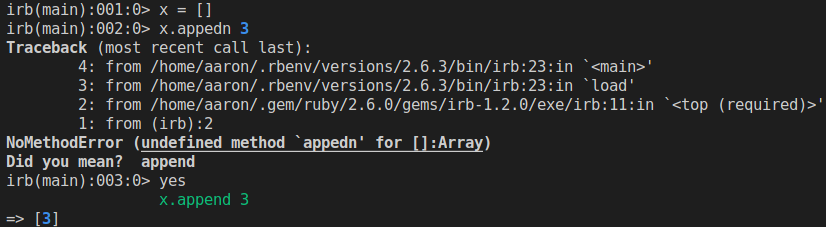

`yes_i_did` is a tiny utility which adds a single method to your IRB sessions,
named `yes`. If you've just typoed the name of something and the "did you mean?"
suggestion in the exception is correct, simply run `yes` to re-run your last
IRB code snippet with the suggestion!



This can be a massive time-saver for quick IRB experiments.

Note: Always check the suggestion before running `yes`, and never use this
for anything which could modify important data! I accept no responsibility if
this deletes your Rails database with its suggestion or something.

# Installation
First, install the gem:

```
gem install yes_i_did
```

Then add this line to `.irbrc` in your home directory (create it if it doesn't
exist):

```ruby
require 'yes_i_did'
```

You'll now be able to use `yes` in your IRB sessions.